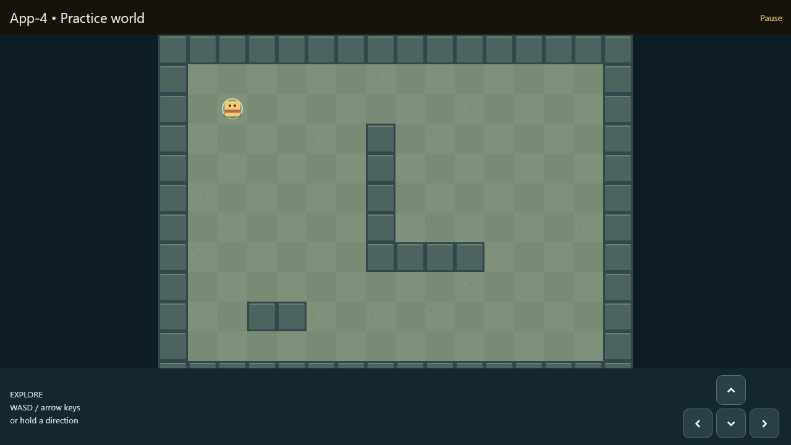

# A2 exploration shell — partial implementation

A2 now owns the default app entry point and authoritative WorldHost. It uses B1
PR #5 at 10c7279 and the approved B1-v1 contract from A1 at 2d31206. This branch
is stacked on codex/b1-exploration. Do not merge it into B1: land dependencies,
retarget to main and review the resulting A-only diff before merging.

## Available now

- New Game asynchronously loads the B1 practice map and synthetic party fixture.
- The stable host publishes state/revision synchronously; pause/resume gates
  movement and clears B's held input through its existing notifications.
- Accepted movement validates map and full footprint using B's validator.
  Stale, gated, invalid and reentrant updates reject without mutation.
- Loading, cancel, failure/retry and session restart are covered. A cancelled or
  disposed load cannot overwrite a later session. Revisions never reset.
- World view remains mounted across ordinary state changes and pause. Inactive
  application lifecycle pauses the session; returning requires explicit resume.
- End session returns to title; the UI states that progress is not saved.
- Renderer stays B1's Flutter CustomPainter/Ticker; no Flame migration or new
  dependency is needed. A does not modify lib/world or B's tests.

Run `flutter run -d chrome` or serve the standard release web build. The default
CI artifact now opens this shell instead of the counter. B's separate demo stays
available at lib/world/demo/main.dart. The counter test is replaced by shell tests.

## Deliberately pending

All encounter requests currently return false without mutation: no real encounter
registry, battle launch/result adapter, rewards or battle-return flow is available.
No successful-encounter behavior or exactly-once battle-result handling is claimed.
This is an explicit capability limit until the C-facing contract is settled.

Title/pause/error screens are temporary A-owned shell scaffolding, not D1 menus.
No inventory/job/equipment commands, dialogue API, game-over flow, save/load or
Continue support is implied. C/D proposals remain provisional. A3 owns persistence.
New Game uses synthetic fixture party data, not agreed game balance/content.

## Completion gate

A2 remains incomplete until the battle input/result decisions and UI boundaries
are settled, a fixture battle can enter/exit through the coordinator, duplicate
results are rejected with exactly-once application, and peer review is complete.
B1 still needs its own review; integrating it here is not approval of PR #5.

## Verification

Controller tests cover atomic publication, stale/reentrant/invalid movement,
gate-only notifications, monotonic revisions, cancellation races, failed loads,
invalid spawns, disposal and explicit unsupported-encounter rejection. Shell tests
exercise B's real view, held-input clearing, stable view/host lifetime, restart and
loading/error recovery. These do not certify any deferred combat/save behavior.

Local validation: analysis clean; all 44 tests passed (including 1280x720 and
480x640 shell checks); release web build passed. Browser preview confirmed title,
New Game and pause flow at 1280x720. The image below is a widget-harness capture
with real fonts, not a browser screenshot. Refresh via the A2_CAPTURE,
A2_TEXT_FONT and A2_ICON_FONT defines in test/widget_test.dart.

