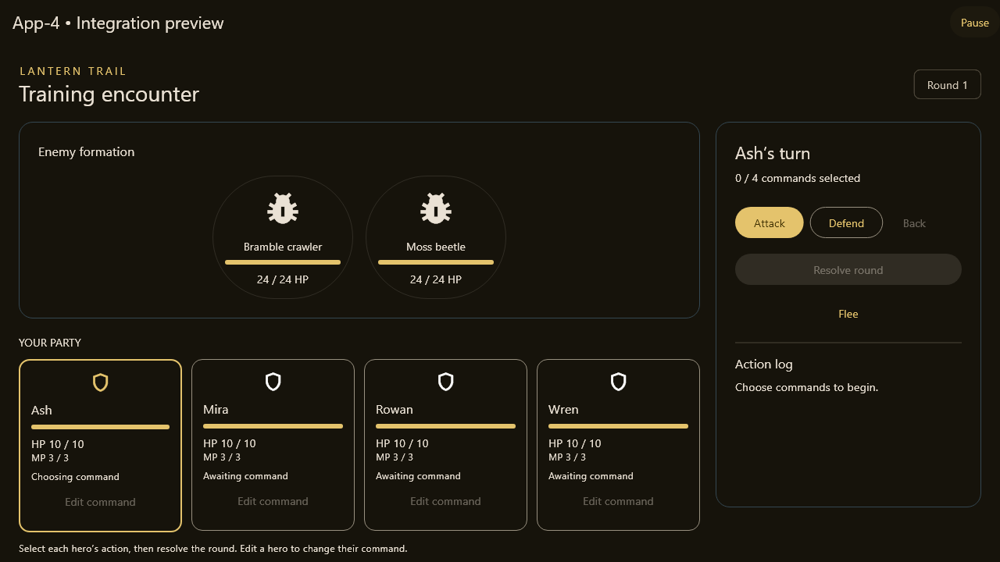

# A5 connected preview - September 29, 2026

Trello: https://trello.com/c/Yh3Faz3c

Combines B2/B3 PR #9 at `273749b` and C2 PR #10 at `de2bc06`, sharing
A2/D1/D4 PR #6 at `75d8d25`. C2 also contains C1 PR #7. This is a draft
integration checkpoint, not approval or merging of those PRs. Do not merge
into a dependency feature branch. Land/review dependencies, retarget main,
and review the remaining integration diff.

## Playable now

Run `flutter run -d chrome` or serve the release web build. New Game loads
Luke's connected Bellwether, Causeway and Cistern prototype maps. Face a target
and use E/Interact for Trey's dialogue or the authored supply chest. Walk onto
marked exits to travel. A commits chest rewards and opened IDs atomically.

Training battle opens Joseph's C2 screen and C1 engine. It reuses his demo
roster/stats and guaranteed training escape. Attack/Defend rounds update HP;
Victory/Escaped -> Continue returns to the exact launch position. Defeat ->
Continue reaches A's game-over/New Game/title flow. No battle rewards, healing,
quest flags or item costs are invented. Pause during exploration to save one
local slot; Continue restores the saved world, party, inventory, gold, flags and
opened chests. New Game does not replace the slot until the player saves.

The default preview uses explicit Training battle rather than fabricated random
encounter tables for D's maps. An integration test connects B's real accepted
movement/EncounterStepper to C and verifies return cooldown. B/C still supply
authored zone-to-encounter mappings for normal exploration.

## A coordinator boundary

`AppController(battles: {definitionId: BattleFactory})` accepts registered
encounters with a current expected revision during unpaused exploration and a
living party. It creates one BattleInput and C BattleSession synchronously.
Factory failure, mismatched input or terminal initial session rejects unchanged.
Factories may read the supplied snapshot but cannot mutate the host. A gates
movement and publishes the session before returning true. The baseRevision is
that launch publication revision. Encounter IDs increase across New Game.
The mounted battle screen exclusively owns C session mutation.

`acceptBattleResult` requires the exact terminal result of the current session,
matching encounter ID/base revision, battle mode and an unpaused coordinator.
Forged/copied, stale and repeated results cannot commit. Pause revisions do not
invalidate launch correlation. A applies C's final snapshot once, restores the
captured world position/quest flags, clears the session before notifying, and
selects exploration or game over. C2 preserves non-HP party fields, inventory
and gold; future reward/progression adapters require their own review.

`lib/save/` now stores a strict schema-1 JSON envelope through
`shared_preferences` on web and desktop. A saves only during paused exploration,
holding world writes until the one-slot write finishes. Saving does not advance
the runtime revision. Continue rechecks content version, party identity,
registered item/job/flag/chest IDs and B's full-footprint collision against a
freshly loaded world before one atomic state publication. Missing, unreadable,
unsupported and unavailable saves never change the live state. The save contains
no encounter, input, listener, pause state or revision. A successful Continue
advances the current host revision so old movement requests stay stale.

## Pause adjustment for Joseph to review

Two C UI files gain an optional `ValueListenable<bool> pauseSignal` with a null,
backward-compatible default. A supplies its notifier/value. The screen keeps
its session/controller on ordinary rebuilds. Paused input/result delivery is
rejected; event playback waits for resume, and disposal releases waiting work.
C1 resolves each round atomically before log playback, so pausing does not undo
an already resolved round. No new round starts while paused. App inactivity
sets pause; returning to foreground does not automatically resume.

This small integration adjustment is isolated on A5; Joseph's source branch
stays unchanged. No combat formulas, world geometry, content data or shared
DTOs are changed by the A commit.

## Validation

- Full combined suite: 153 tests passed; one optional D image test skipped.
- Analysis clean; default release web build passed. Browser smoke check confirmed
  New Game, training launch, pause/resume, escape and return to Bellwether at
  the identical position (4.5, 6.5).
- Nine new tests cover atomic launch, rejected factories/stale requests,
  correlated once-only results, victory/defeat/escape, delayed old results,
  B movement-to-C battle/cooldown, pause/disposal and the default UI loop.
- Three save tests cover strict round-trip data, incompatible/corrupt rejection,
  and chest/battle progress surviving Continue. The default UI test now also
  exercises Save game, End session and Continue.
- 1280x720 widget evidence below; inherited narrow-layout tests also pass.
- Windows is checked by GitHub CI after push; no local Windows build claimed.

## Next owners / completion gates

- Luke: review combined world integration; supply authored zone bindings when
  C supplies encounter IDs and rosters.
- Joseph: review pauseSignal and session/result handoff; provide production
  hero/job/equipment stats, encounter rosters and C3 flee/C4 reward rules.
  C2's adapter is connected; the earlier request to build one is obsolete.
- Trey: dialogue/content are connected through B's maps. Party commands need
  C4. Review combined UI when ready.
- Jordan/A: replace training registration when those handoffs arrive. The
  one-slot save path works with the current fixture state and draft content
  version; production stat/content changes require a migration decision.

A2/A5 remain integration review candidates pending the production B/C content
handoffs. Cross-reload chest protection is implemented. Nothing is marked Done
or merged to main by this work.
