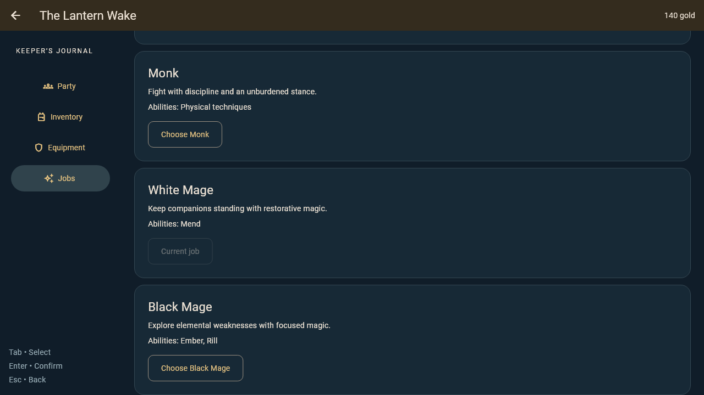

# C4 job and progression rules

`LanternJobRules` is C4's framework-independent implementation of the existing
`PartyRules` contract. A owns when a menu is available and commits an accepted
snapshot once; D sends the existing `ChangeJob` and `EquipItem` commands and
shows typed rejections. The UI preview now uses this adapter as a working menu
integration example.

## Starter jobs

Every hero can choose each of these starter jobs outside battle. The identifiers,
equipment lists, and ability identifiers match D4's `lantern_wake.json`.

| Job | Level 1 HP / growth | Level 1 MP / growth | Attack / defense / speed | Commands | Equipment |
| --- | --- | --- | --- | --- | --- |
| Warrior | 38 / +6 | 0 / +0 | 12 / 10 / 6 | basic physical commands | Harbor Blade, Keeper Coat |
| Monk | 34 / +5 | 0 / +0 | 11 / 7 / 11 | basic physical commands | Rope Wraps, Keeper Coat |
| White Mage | 26 / +3 | 10 / +3 | 5 / 5 / 7 | Mend | Shell Staff, Linen Robe |
| Black Mage | 24 / +2 | 12 / +4 | 6 / 4 / 8 | Ember, Rill | Shell Staff, Linen Robe |

`profileFor(member)` is the single C4 lookup for current-job stats, commands,
and allowed equipment. C3's combat adapter can use it when selecting commands
and calculating stats.

## XP and job progress

- Character XP is permanent. A level is `floor(XP / 100) + 1`, so level two
  begins at 100 XP.
- A reward increases permanent XP and only the active job's progress by the
  same amount. Switching never changes any stored job progress.
- `grantExperience` returns the complete new `GameState`; the battle result
  must use that resulting party instead of adding the reward a second time.

## Switching, resources, and equipment

- Job changes recalculate maximum HP and MP for the character's permanent
  level. Current HP and MP are clamped down to the new maxima and never raised.
  Switching therefore cannot heal or restore MP.
- An item incompatible with the new job is automatically unequipped and moved
  to the bag once. Bag counts exclude equipped instances, so this is a transfer,
  not a duplicate.
- Equipping consumes one matching item from the bag. Replacing or unequipping
  an item returns the old item to the bag. The rules reject unknown items,
  wrong slots, unavailable bag items, and items the current job cannot use.

The C4 table uses the existing Warrior, Monk, White Mage, and Black Mage names.
Breakwater, Tide Striker, Lantern Keeper, and Stormcaller require D's naming
decision and a later C combat-status design.

## Review evidence

The C4 capture pumps the existing party menu, changes Ada from Warrior to White
Mage through the real `PreviewHost`, and records the accepted state at 1280×720.

