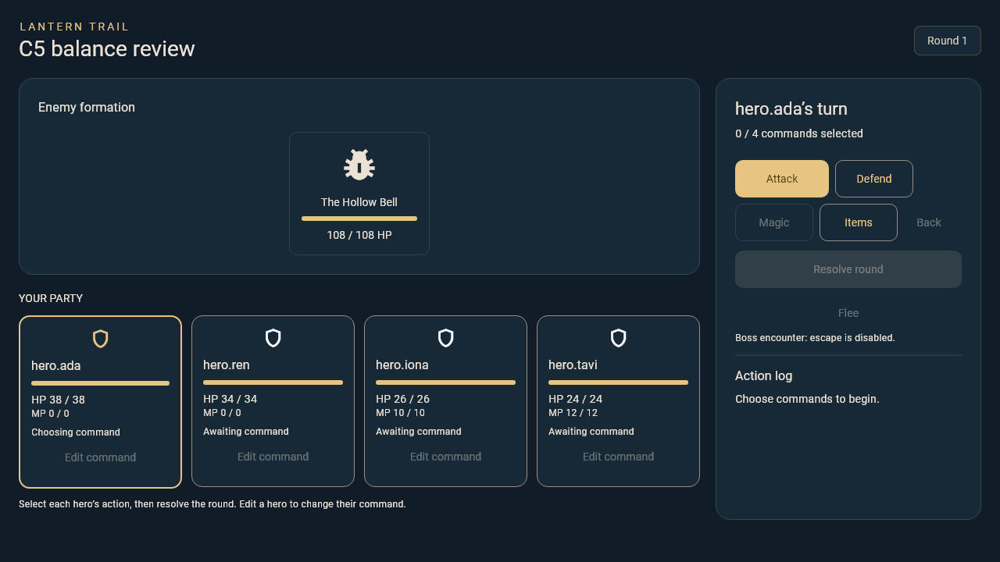

# C5 enemy balance

`LanternBalance` supplies one C-owned encounter table for D4's four enemy IDs.
It builds combatants from the current C4 job profile and applies a reward only
to a victory result. A commits that final result once through its existing
correlation guard.

| Enemy | HP | Attack / defense / speed | Pattern | XP / gold |
| --- | ---: | --- | --- | --- |
| Brine Mite | 28 | 6 / 1 / 7 | Attack | 24 / 8 |
| Wick Moth | 40 | 5 / 2 / 10 | Ember at lowest HP, Attack | 30 / 12 |
| Silt Guard | 54 | 8 / 6 / 4 | Defend, Attack | 42 / 18 |
| Hollow Bell | 108 | 0 / 5 / 8 | Rill at lowest HP, Defend | 90 / 50 |

The Hollow Bell's two behaviors are visible: Rill pressures the party member
with the lowest current HP, then Defend reduces incoming damage for that round.
It is marked as a boss, so escape stays disabled.

## Resource and reward rules

- C5 uses Mend 14 HP for 2 MP, Ember 11 damage for 3 MP, and Rill 8 damage
  for 3 MP. Salve, Ether, and Wake Seed recover 18 HP, 8 MP, and 12 HP.
- The C3 practice values remain unchanged. C5 passes its balanced rules only
  to authored encounters.
- Victory increases every party member's permanent XP and current-job progress,
  then adds gold. Flee and defeat return no rewards. A battle session caches its
  terminal `BattleResult`, so its reward callback cannot run a second time.

## Playtest matrix

`test/battle/c5_balance_test.dart` plays all four encounters with deterministic
commands and seeded rolls. It verifies both starter-job compositions finish the
route, the boss needs several rounds and includes Rill and Defend, and victory
rewards are applied once.

| Composition | Intended use |
| --- | --- |
| Warrior, Monk, White Mage, Black Mage | Physical damage plus recovery and damage magic |
| Warrior, Warrior, White Mage, Black Mage | A second front-line composition that still uses recovery and magic |

The matrix starts each route with full C4 level-one resources and the same small
bag: two Salves, one Ether, and one Wake Seed. Route rest points remain A/B/D's
world behavior; this combat matrix does not grant free recovery between fights.

Use `LanternBalance().createSession(input)` at the A/C boundary for the four
`enemy.*` encounter IDs. The C5 demo supplies a review fixture at
`lib/battle/demo/c5.dart`; it is deliberately separate from the C3 practice
fixture and from A's campaign encounter registration.
