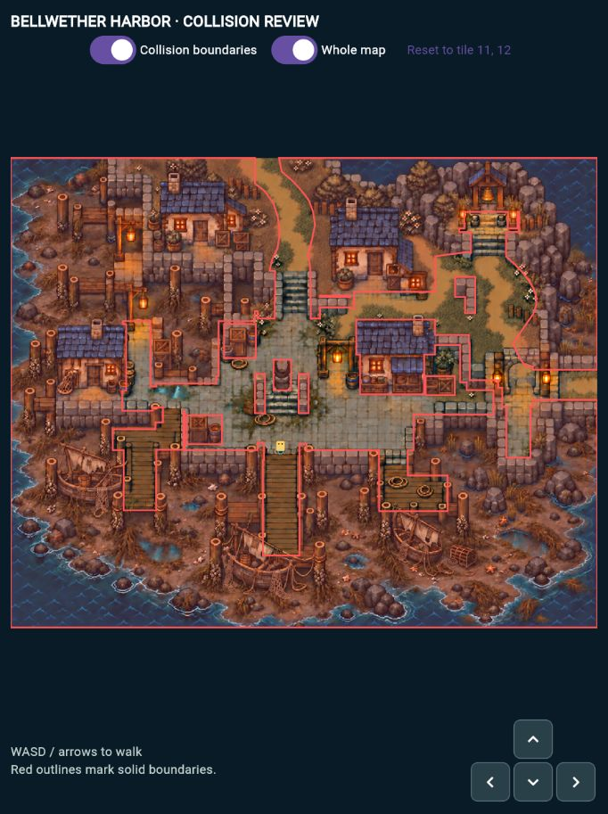
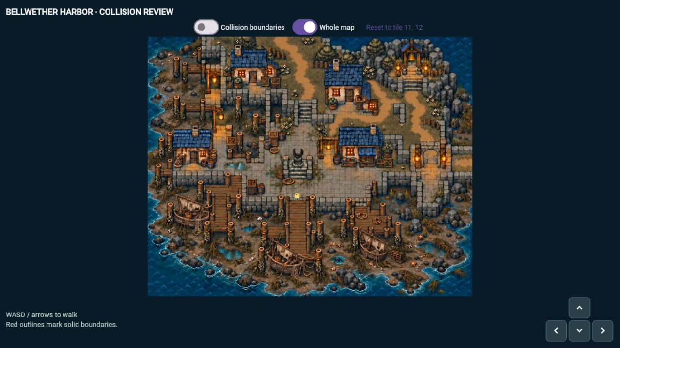

# Bellwether harbor art and collision preview

This isolated preview contains Luke's approved harbor artwork and collision boundaries. Run it with:

```sh
flutter pub get
flutter run -d chrome -t lib/world/demo/harbor_art_main.dart
```

Use WASD, arrow keys, or hold the on-screen direction buttons. **Whole map** fits the entire harbor on screen; turn it off to use the following camera. **Collision boundaries** toggles the red overlay. Reset returns to the requested tile 11,12, expressed in the original 25 by 20 review grid.

The artwork and collision share a 1402 by 1122 coordinate space. Movement uses a small footprint at the character's feet and swept steps to prevent crossing narrow obstacles. The stairs, docks, bell terrace, north trail, house-side passage, and east exit remain connected. The entire upper-left pocket, including its two small side piers, is blocked following Luke's final review.

The approved asset is `assets/maps/bellwether_harbor_paths_v3.png`. Green-marked props were removed during the art review; the house-side passage and north trail were edited for traversal. Built-in image editing prompts are preserved in [the edit notes](harbor-art-edit-prompts.md).



The preview was also checked at a verified 1280 by 720 CSS-pixel game viewport:



Validation: full Flutter analysis passed, and the full suite passed with 193 tests and three skips. This includes four collision tests covering reachable destinations, the blocked northwest pocket, solid props, and movement against the monument and dock edge. Luke also approved the browser preview after the final boundary adjustments.

The three new Dart files pass the formatting check. The full repository formatting check reports five existing files on the base branch: `lib/app/game_app.dart`, `lib/battle/demo/c5.dart`, `test/battle/c5_balance_test.dart`, `test/world/tutorial_island_map_test.dart`, and `test/world/world_encounters_test.dart`. Those unrelated files are unchanged here.

Locked dependency installation, the normal release web build, and the standalone harbor release web build passed. Windows was not rebuilt locally; this preview adds no platform-specific code.

```sh
flutter test test/harbor_geometry_test.dart
```

This entry point is a visual prototype with a neutral player marker. The production world/coordinator still uses the existing maps. Quest interactions, encounters, map transitions, and production character art are not connected to this preview.
