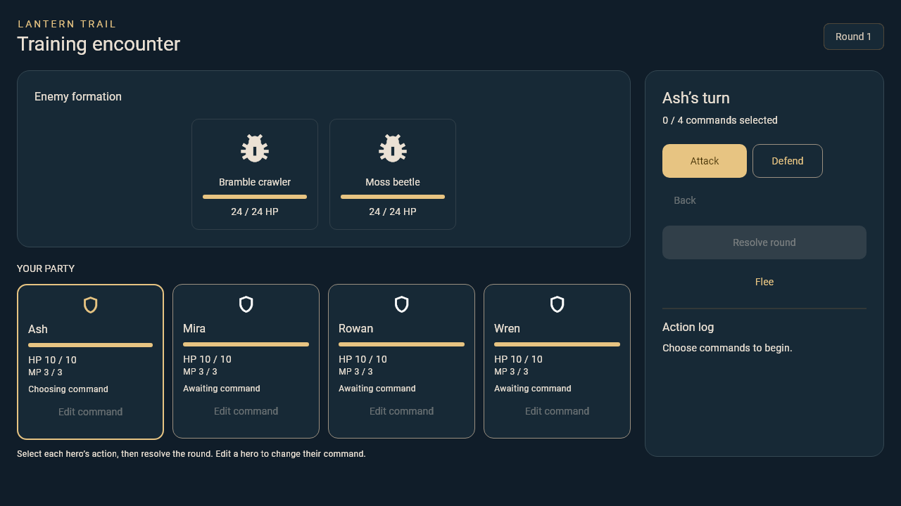

# C2 battle screen and command selection

Card: https://trello.com/c/gdzHxP1x/17-c2-build-the-battle-screen-and-command-selection

## Run and review

```sh
flutter run -d chrome -t lib/battle/demo/main.dart
flutter test --no-pub test/battle
```

The separate training demo uses C1's real engine and D's `lanternTheme` and
`MenuPanel`. Names/stats/enemies are synthetic. The default app remains A2's
exploration shell; no A/B/D implementation files or shared contracts are changed.

This branch combines A2/D1/D4 at `75d8d2540d4ed0975325d869c09dc213285e4687`
with C1 at `b95ea46722eb4ed20731a517fb69f70d519cfc80`. The PR is stacked on
A2 PR #6 and also requires C1 PR #7. Do not merge this into the A2 feature branch.
Land dependencies, retarget main and review the resulting C2 diff before merge.

## Implemented

- Four hero panels with HP/MP, current actor highlighting and chosen commands;
  enemy HP and explicit Defeated/Knocked out states.
- Attack then a living enemy target; Defend advances directly. Cancel target
  returns to action choice. Back removes the previous choice. Edit clears that
  hero and later selections so command order stays coherent.
- Resolve is enabled only after all living heroes select. The controller locks
  input synchronously before C1 resolution and keeps it locked during the action
  log playback. Repeated taps do not resolve another round.
- C1 alone determines damage, turn order, retargeting, knockout and terminal
  outcomes. HP panels publish the completed round after the log playback.
- Victory/defeat/escape display a Continue action that delivers one shared
  `BattleResult` through `onCompleted`. The caller owns navigation and applying
  the result. Repeated Continue callbacks are ignored by the screen controller.
- Replacing the session discards pending selection/playback; disposed screens
  do not notify or invoke completion from old asynchronous work. System back
  cannot silently abandon the encounter.
- Scrollable responsive layout uses the existing D theme. Primary review size
  is 1280×720; narrow 480×640 is covered by widget tests.

## A2/A5 adapter contract for review

Create a `BattleSession` with the shared `BattleInput`, C-provided `heroStats`
keyed by party IDs, and C-provided enemy `Combatant`s. Hero HP/maxHP come from the
input, not a second stat source. Missing stats, invalid stats or malformed
rosters reject construction. The session retains its seeded C1 engine across
ordinary screen rebuilds. Create one session per encounter and give it one
screen owner; do not concurrently call session mutators from elsewhere.

Mount `BattleScreen(session: session, onCompleted: acceptResult, names: names)`.
The result preserves encounter ID, base revision, party order/IDs and every
non-HP party field. Inventory and gold are unchanged: this Attack/Defend slice
has no costs or rewards. A must still validate correlation and commit once;
screen-level duplicate suppression does not replace coordinator protection.
The shared combat contract remains provisional pending Jordan/Joseph agreement.

The A2 host currently rejects all encounters. Jordan still needs to wire launch,
movement gating, final snapshot acceptance and return/game-over navigation in
A-owned files. This C2 PR supplies the battle screen/result adapter; it does not
claim that exploration-to-battle integration is already available.

## Flee and later C work

No production flee formula is invented here. `FleePolicy` is an optional async
callback supplied to the session. No callback means Flee is disabled. `true`
ends with `BattleOutcome.fled`; `false` leaves the current commands/round intact;
errors unlock controls with a retry message. Pending attempts reject repeats and
round resolution. The demo injects guaranteed success solely to exercise this UI
and result path. C3 must decide attempt costs, turn consumption and chance; any
resource-mutating flee policy requires an expanded C-owned adapter and tests.
Magic/items and progression/rewards remain C3/C4 work.

## Acceptance evidence

`test/battle/battle_screen_test.dart` covers selection/backtracking, invalid
targets, result field preservation, victory/defeat/flee callback paths, duplicate
submits/Continue, failed/error/pending flee, disposal and session replacement.
The full suite also retains C1's deterministic combat tests.

Screenshot below is a real-font widget-harness capture at 1280×720. Generate with
`C2_CAPTURE=true`, `C2_TEXT_FONT` and `C2_ICON_FONT` Dart defines when running the
layout test. Browser smoke checks are reported separately in the PR.



Remaining completion gate: Luke's peer review, Jordan/Joseph's agreement on
combat/stat sources and A2/A5 integration. Keep the card in Review / Testing
until accepted and integrated; passing tests alone do not mean Done.
