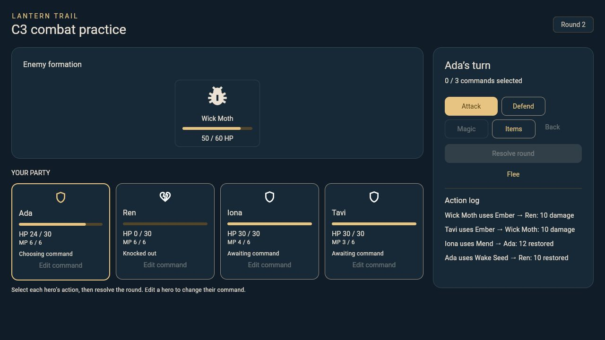

# C3 magic, items, flee and enemy behavior

Card: https://trello.com/c/jINtTqUy/18-c3-add-magic-items-fleeing-and-enemy-behavior

## Review and run

This branch starts at A5 `f2e9183bc9f2e88e4073ab1845400ea9d521c5fa` (PR #11).
It retains Jordan's pauseSignal and correlated result integration. Review C3
against that branch; land dependencies and retarget main before merging. Do not
merge into A5's feature branch. Luke is the peer reviewer; Trey reviews the new
Wake Seed content entry and Jordan reviews the resource result boundary.

```
flutter run -d chrome -t lib/battle/demo/c3.dart
flutter test --no-pub test/battle
```

The separate practice entry point offers regular and boss encounters. It uses
D4's hero/job/spell IDs and synthetic stats/inventory. Ren starts knocked out
so revival can be tested. No campaign state is written. The normal A5 app still
registers its existing Attack/Defend training fixture; production encounter
registration and C4/C5 stat/progression/balance handoffs remain separate.

## Rules

`CombatRules` contains effect IDs, names, kind, amount, MP cost and flee tuning.
`Combatant` holds current/max MP, learned spell IDs, an enemy move pattern and
an explicit boss flag. Inputs and snapshots remain immutable.

| Action | Cost | Effect and allowed target |
| --- | --- | --- |
| Mend | 2 MP | Restore 12 HP to one living ally |
| Ember / Rill | 3 MP | Deal 10 damage to one living enemy |
| Harbor Salve | 1 item.salves | Restore 20 HP to one living ally |
| Dew Phial | 1 item.ether | Restore 6 MP to one living ally |
| Wake Seed | 1 item.revival | Restore 10 HP to one knocked-out ally |

Healing/recovery clamps to the target maximum. Full-health/full-MP living allies
are valid targets and consume the resource even when nothing is restored.
Damage spells use their configured flat power, bypass physical defense and
respect Defend (half damage, rounded up). Physical attack retains C1's formula
and seeded variance. No elemental resistance system is claimed in C3.

The engine validates the entire round before mutation or RNG: distinct living
heroes, known/learned effects, enough MP, legal targets and enough shared items
for all selected commands. The UI reserves counts while selecting but pays
nothing until resolution; Back/Edit releases reservations.

Costs are paid once immediately before a valid action resolves. A knocked-out
actor loses its turn without cost. Dead offensive targets retarget the first
living opponent. A healing/revival target that becomes invalid causes a logged
skip without cost (no automatic ally retarget). Two pending revivals on the same
ally consume only the first item. Revived allies who began the round knocked out
act next round, and can be attacked again in the current round. A terminal hit
stops all later actions and costs. Old round numbers and terminal repeats reject.

## Escape

Production rules use one seeded roll in [0,99]. Success chance is:

`clamp(50 + 5 * (fastest living hero speed - fastest living enemy speed), 10, 90)`

Success ends immediately with `BattleOutcome.fled`. Failure forfeits all hero
actions for that round; enemies follow their normal pattern, with no hero Defend
bonus. The round advances, pending UI choices clear, and HP/MP/log update after
playback. Failure can cause defeat. No inventory/MP flee fee is charged.

Any enemy marked `isBoss` disables escape for the entire encounter, including
after that enemy is defeated. Rejection happens before RNG/round changes and
cannot be bypassed by the legacy callback. The old `FleePolicy` is retained only
for existing A5 training/custom fixtures; omit it to use C3's rules. A failed
legacy callback still retains commands, preserving its previous API behavior.

## Enemy decisions

Patterns cycle by round number, including failed-escape rounds:

- Brine Mite: Attack first living opponent.
- Wick Moth: Ember on lowest current HP opponent, then Attack; repeat.
- Silt Guard: Defend, then Attack; repeat.
- Hollow Bell: Rill, Attack, Defend; repeat. Boss escape is disabled.

Targets are chosen at action time; roster order breaks equal-HP ties. Enemies
pay spell MP just like heroes. Insufficient MP/no eligible spell target falls
back to an Attack; low-HP targeting remains in effect when MP runs out. Defense
covers the whole round, as in C1. The pattern and spell set must be attached to
each encounter Combatant; a blank pattern preserves C1's basic Attack AI.

## A/D integration

Construct `BattleSession` with:

- the exact A `BattleInput`, C4/C5 `heroStats` and enemy roster;
- `rules: lanternCombatRules()`;
- `heroSpells` keyed by party member ID, using the current job's approved ability
  IDs (D4 job rows already list these; don't grant every spell to every hero);
- enemies with MP/maxMP, allowed spell IDs, `lanternEnemyPatterns[definitionId]`,
  and `isBoss` derived from D4's enemy kind; distinguish definition IDs from
  unique combatant instance IDs when spawning duplicates;
- no legacy fleePolicy for production.

`BattleResult` now carries final HP, MP and inventory for victory/defeat/escape.
Encounter ID/base revision, party order, jobs, maxima, equipment, experience,
job progress and gold are preserved. A5 can apply the exact session result
through its existing one-time boundary. No shared DTO changes are required.
No rewards/progression are granted. Verify campaign save/restore once production
registrations are supplied. Adding the optional `item.revival` catalog entry
keeps schema/content version unchanged: existing saves remain readable; older
clients will reject saves containing that new item rather than silently drop it.
Trey should review its name/description and eventual acquisition source.

## Evidence

- 174 full-suite tests pass; one existing optional image test skipped.
- 18 C3 tests cover costs, invalid/unlearned actions, item overbooking and
  exhaustion, HP/MP caps, duplicate revivals, knockout skips, terminal costs,
  enemy patterns/MP fallback, deterministic replay, flee success/failure/boss/
  defeat, result preservation, pause/duplicate input and narrow-screen UI.
- Analyzer clean; release web demo builds. Local Flutter 3.47.2/Dart 3.13.2;
  repository CI pins 3.47.1/3.13.1.
- Browser: selected Wake Seed/Mend/Ember, resolved one round, checked actual
  resource/HP/log updates and exhausted item disabled state; failed escape
  executes enemy actions. Final boss/escape checks are recorded in the PR.
- Windows dependency setup reports missing symlink support on this machine;
  tests and web compilation work. Native Windows build is left to repository CI.



Status: implementation ready for Review / Testing, pending peer review,
D4 content acceptance and production A5 registration. No merges or Done status
are implied by passing tests.
