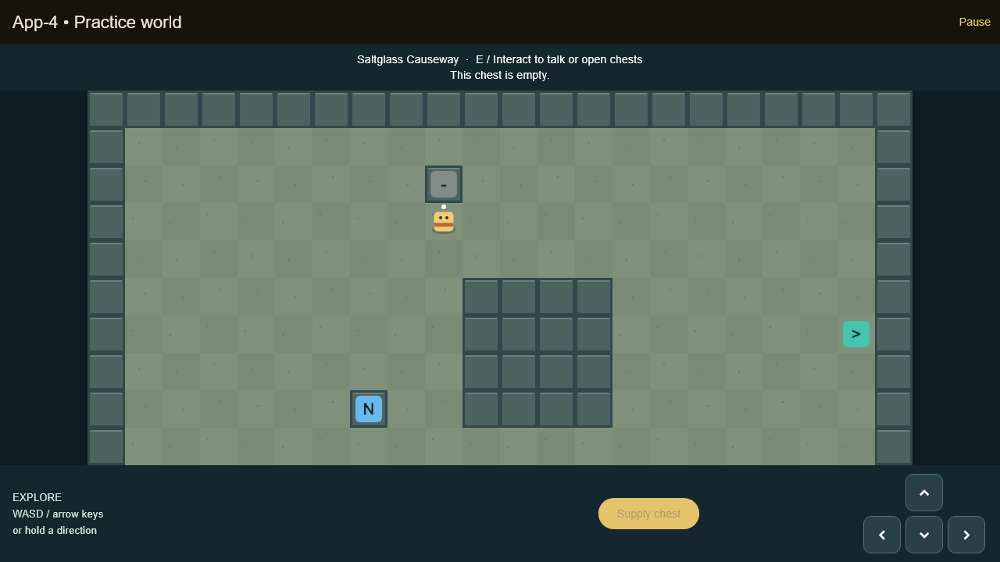

# B2/B3 interaction integration handoff

Based on Jordan's A2 operation handoff `75d8d25` (PR #6), plus our B3
encounter checkpoint `b8f43fb` (PR #8). New work is confined to B's world
module/tests. The default entry point still belongs to A.

## Run the real A/B/D integration

```sh
flutter run -d chrome -t lib/world/demo/interaction_main.dart
```

Choose New Game. Arrow keys/WASD or touch controls move and set facing.
A white dot shows facing. Face the adjacent blue NPC or gold chest and press E
or the named on-screen interaction button. Hold/repeat E cannot repeatedly
reopen dialogue. D's Next/Finish/Close controls dismiss through A's route.
Opened chests turn gray and show an empty message when checked again.

Walk onto teal exit tiles to transition. Arrival points are clear and away
from the return exit, and held movement is cleared. Prototype connections:

- Bellwether east gate -> Saltglass Causeway south landing.
- Causeway south gate -> Bellwether east landing.
- Causeway east gate -> Tide Cistern west landing.
- Cistern west gate -> Causeway east landing.

Mara and Orrin are in town; Sable and the supply chest are on the causeway.
The chest sits on the north side and contains D's authored two Harbor Salves.
There are three prototype layouts using D's stable IDs, not a completed B4
art/map design pass. NPC/chest tiles are solid. All spawns and interaction
approaches are reachable, checked by a flood-fill test.

## Ownership and behavior

`InteractionWorld` assembles maps, target positions and source reach predicates.
It registers B geometry with A's `contentOperations`; the authored content
supplies dialogue and item quantities. Missing/invalid IDs fail registration.
`WorldController` sends only registered IDs with the current revision.
It never changes inventory, opened-chest flags, dialogue state or map state.
A atomically commits the operations. B does not open a second dialogue route.

Chest duplication is tested through repeated inputs, map return, and restoring
an immutable state snapshot containing both inventory and opened IDs. This is
not a storage test: A3 must persist both together. New Game intentionally resets
progress. No healing, quest rewards/flags, boss triggers or progression are
invented from D's narrative text. Those still need their relevant handoffs.
The party remains A1's synthetic fixture pending C's mappings.

Real A2 currently rejects encounters, pending C's handoff. The separate
`encounter_main.dart` target remains the playable B3 fake-battle demo; its
one-in-three chance and three-step cooldown remain provisional team proposals.

## Verification

- PR #6's ten operation tests passed before integration; review posted on its
  exact `75d8d25` handoff.
- New B tests cover facing/range/diagonals, gates and B1 compatibility, solid
  placements, all map spawn/reachability rules, exit transitions and no bounce,
  exactly-once chest grants across map returns/restored state, and real
  A/B/D keyboard/touch flow at 1280x720 and 480x640.
- `b2-interactions.png` is captured from the widget test with actual fonts.



## Team coordination

Luke requested that major gameplay choices be posted to the relevant Trello
card with rationale, provisional settings, and decisions needed from the team.
The explicit interaction, solid target, automatic marked-exit and safe-arrival
proposal is recorded on B3. Treat passing tests as behavior verification,
not final team approval of game design or balance.

This integration branch contains both A2 and B3 ancestry. Keep dependent PRs
stacked for review; merge/retarget only after dependencies and team review.
B2/B3 are not marked Done: durable persistence and real combat are outstanding.
