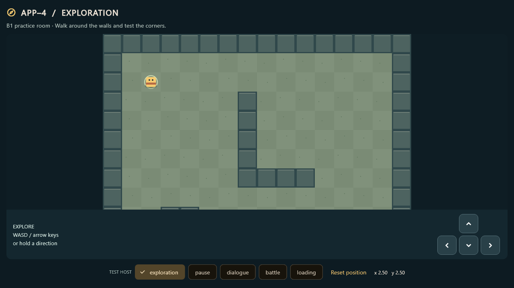

# B1 exploration prototype

Trello: https://trello.com/c/HoKeQKvy

Built against Jordan's approved **B1-v1** handoff at
`2d3120631f1bb83ad09f3a924238e7bd2ebeb1be` in PR #3. That boundary is not yet
on main. This is walking/collision/input with a test host, not A2 integration.
Keep the PR stacked on `codex/a1-contract-proposal` until A1 is merged, then
retarget it to main and recheck the resulting diff before merging.

## Run

With Flutter 3.47.1 on PATH, from the repository root:

```sh
flutter pub get --enforce-lockfile
flutter run -d chrome -t lib/world/demo/main.dart
```

For another browser, use `flutter run -d web-server --web-port 8765
-t lib/world/demo/main.dart` and open the printed address. The primary app's
`lib/main.dart` stays the counter starter. CI's default web artifact therefore
still runs that starter; use the explicit target above to see B1.

The demo's test-host buttons simulate exploration, pause, dialogue, battle and
loading. They only test movement gating; no dialogue/combat/menu flow is implemented.
Reset returns to the entry spawn and advances the existing host revision.

## World behavior

- The original 16 x 12 sketch is represented in `prototype_map.dart`, separate
  from rendering and collision. The parser accepts `#`, `.`, and exactly one `S`.
  It creates the approved `MapDefinition`; no asset registration is necessary.
- Tile coordinates describe the player's center. The sketch's tile (2,2) is
  position (2.5,2.5). The square collision footprint is 0.56 tiles wide.
- Swept cardinal collision stops the entire footprint at the first wall or
  boundary, including corners. Spawns and restored positions need full clearance.
  An invalid restored position stops movement and displays an error; it is not
  silently relocated or saved over.
- Movement is 3 tiles/second. WASD, arrows and on-screen holds are separate input
  sources. The most recently pressed direction wins, with no diagonal speed boost.
- Frame gaps above 100 ms are capped and excess time is discarded. Normal
  30/60/120 FPS movement is time-based; returning from a stall cannot replay a backlog.
- Position is always read from `WorldHost`. Updates use its current revision;
  rejected updates never create an optimistic position. Notification callbacks
  only read/synchronize and never issue host writes.
- Gate disable, focus loss, lifecycle inactivity and host/notifier/map replacement
  clear held controls. Releases/cancellations remove only their own input source.
- The camera follows the player, clamps to large-map edges, and centers maps
  smaller than the viewport. The direction controls sit outside the clipped map.

## A2 handoff

```dart
final builder = worldViewBuilder(map);
// From A's stable view tree:
final world = builder(context, host, changes);
```

The builder conforms to A's `WorldViewBuilder`. Keep the host, notifier and map
stable across ordinary rebuilds. `WorldView` detaches the old notifier before
attaching replacements and removes its listener on disposal. A owns and disposes
the host/notifier after the view detaches. `demo/demo_host.dart` is explicitly
test scaffolding using A1's synthetic party fixture, not a production coordinator.
It rejects encounter requests; B1 never emits them.

The renderer uses Flutter CustomPainter/Ticker with existing dependencies.
Flame adoption remains a separate coordination decision with Jordan. The map and
collision/controller code can be reused by a future renderer. No shared contracts,
app entry point, pubspec, CI, save code, or C/D-owned modules were modified.

## Verification

```sh
flutter analyze --no-pub
flutter test --no-pub
flutter build web --release --no-pub -t lib/world/demo/main.dart
```

Tests cover map validation, full-footprint walls/corners/bounds, frame-rate
consistency, input priority, stall policy, rejected writes, synchronous host
notifications, monotonic revisions, camera clamping, pointer cancellation, focus
and lifecycle reset, every test-host gate, host replacement and listener disposal.
Layout checks cover 1280 x 720 and 480 x 640. Browser checks at 1280 x 720 confirmed
rendering, keyboard movement and paused movement with the coordinate readout.



This image is captured from the widget harness with real fonts; browser rendering
was separately inspected. To refresh it, run the layout test with
`--dart-define=B1_CAPTURE=true`, `--dart-define=B1_TEXT_FONT=<path-to-text-font>` and
`--dart-define=B1_ICON_FONT=<Flutter-SDK>/bin/cache/artifacts/material_fonts/MaterialIcons-Regular.otf`.
Font loading is opt-in; normal tests do not depend on local font paths.

## Still outside B1

No NPCs, dialogue requests, chest rewards, quest flags, map transitions or encounter
logic are added. B2-B5 need their separate contracts and cards. Real A2 integration,
teammate review and merge are still required before marking B1 Done. Final art and
audio belong to Trey; these shapes/colors are prototype placeholders.
